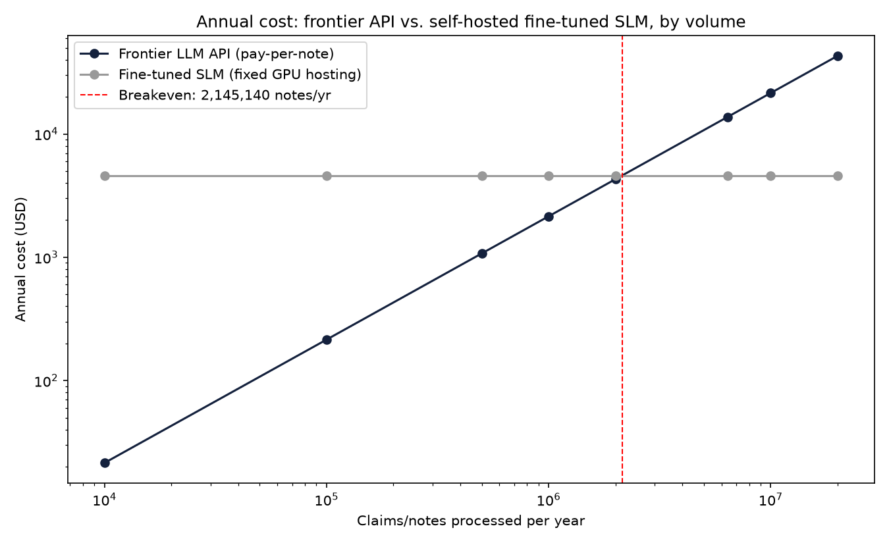

# HCC Coding Gap Classifier

A fine-tuned small language model (SLM) that flags Medicare risk-adjustment claims where clinical documentation doesn't actually support the billed diagnosis category — built to demonstrate that a small, locally-hosted model can match or beat a frontier LLM on a narrow enterprise task, at a fraction of the cost.

## The Problem

Medicare pays insurers more for sicker patients through the CMS-HCC risk adjustment model — each diagnosis maps to a "Hierarchical Condition Category" (HCC) with a real dollar value. If a clinician's note doesn't document enough clinical specificity to justify a billed HCC, that's a documentation gap: either lost revenue or audit exposure. Insurers run large human chart-review teams to catch this at scale. This project automates the first pass of that review.

## Headline Result

| Metric | Claude Opus 4.7 (frontier, prompted) | Fine-tuned Phi-3.5-mini (SLM, LoRA) |
|---|---|---|
| Accuracy (162-example held-out test) | 75.9% | **88.9%** |
| Cost per note | $0.0021 | **$0.00 marginal** |
| Avg latency | 1.15 sec | **1.10 sec** |
| Latency std dev | 0.77 sec | **0.07 sec** |

The fine-tuned small model outperformed the frontier model on accuracy, cost, and latency consistency, on a test set built and verified to have zero overlap with any training or development data.

## ROI: Cost at Scale

Using a real AWS g4dn.xlarge hosting rate ($0.526/hr) against the measured Claude API cost per note, the breakeven point is **~2.15 million notes/year**. UnitedHealthcare's ACA marketplace segment alone processed 6.4 million claims in 2024 (CMS Transparency in Coverage data) — 3x past breakeven, on just one product line out of many.

## Methodology

1. **Ground truth**: Official CMS-HCC Model V28 ICD-10-to-HCC crosswalk and RAF dollar-value coefficients, pulled from the `hccinfhir` package (sourced from CMS's own published model files).
2. **Realistic population structure**: CMS DE-SynPUF synthetic Medicare claims data (10,000 beneficiaries) for demographics and real chronic-condition flags.
3. **Synthetic clinical notes**: Since real chart text is never public, notes were generated at varying documentation specificity levels (Fully Supported / Insufficient / Unsupported), anchored to real diagnosis codes and the real V28 crosswalk.
4. **Golden development set** (146 examples) + **hard negatives** (relevance-checking traps: wrong disease subtype, normal/resolved values, family history) added after error analysis revealed a model blind spot.
5. **Final held-out test set** (162 examples): built independently, never inspected for error patterns, never used to influence any training decision — used exactly once to produce the headline numbers above.
6. **Fine-tuning**: LoRA adapter on Phi-3.5-mini-instruct (4-bit), trained locally via Apple's MLX framework — no cloud GPU required.

## Known Limitations

- Clinical note text is synthetic (template/LLM-generated), not drawn from real patient charts, since real documentation is never public. Labels are grounded in the real CMS-HCC crosswalk, not the note text itself.
- The fine-tuned model still struggles on adversarial "trap" cases requiring cross-referencing a specific clinical value against the specific billed code (e.g., wrong diabetes subtype, a normal lab value) — it relies more on lexical pattern-matching than the frontier model does on these specific cases. In production, this is the kind of case that should escalate to human review rather than be auto-resolved.
- ROI model assumes a single g4dn.xlarge instance; does not include DevOps/MLOps staffing overhead for production deployment.

## Repo Structure
data/processed/     - Clean derived datasets (crosswalk, labeled notes, eval sets, benchmark results)

data/finetune/      - Train/valid JSONL for LoRA fine-tuning

adapters/           - LoRA adapter checkpoints (best-performing only; intermediate checkpoints gitignored)

scripts/            - Numbered, sequential pipeline scripts (01-28)

## Tech Stack

Python, pandas, `hccinfhir` (CMS-HCC model data), Anthropic API (Claude Opus 4.7 baseline), MLX / `mlx-lm` (Apple Silicon LoRA fine-tuning), Phi-3.5-mini-instruct, matplotlib.

## Engineering Notes

This project went through several real, documented debugging cycles: a model-version filtering bug in the RAF coefficient table, an ICD-9/ICD-10 vintage mismatch in public claims data, a ground-truth labeling design flaw that would have let the model shortcut the task, a CHF billing-code exclusion caught by reading official HCC category names carefully, a test-set leakage issue from iterating on the same eval set used for development, and a chat-template mismatch that initially produced 0% accuracy. Each is documented in the corresponding numbered script's git history.

